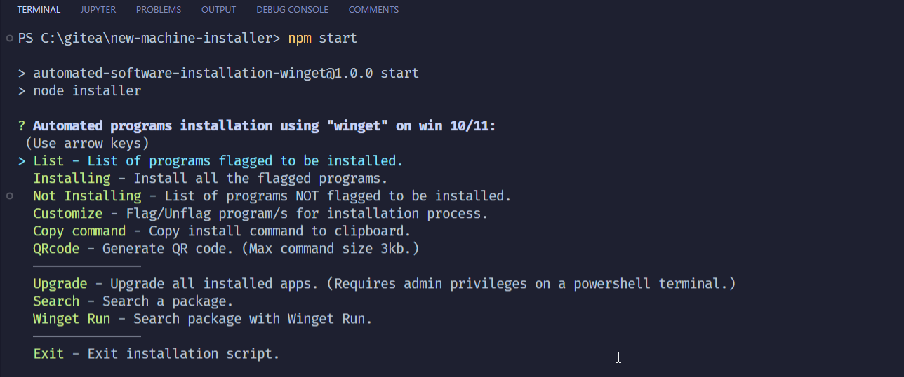

# Windows software installer

Are you tired of searching for the software you need to install on a new machine/VM, or when you need to recover your current machine?

Just run the script in this repo, pick the programs you want to install and then go afk until everything is finally installed.

Only catch is that this only work on windows 10 and 11 as it's using winget.

# Dependencies
Windows 11:
- [nodejs](https://nodejs.org/en/)

Windows 10:
- [winget](https://github.com/microsoft/winget-cli/releases/download/v1.3.2091/Microsoft.DesktopAppInstaller_8wekyb3d8bbwe.msixbundle)
- [nodejs](https://nodejs.org/en/)

# Options

List - List of programs flagged to be installed

Installing - Install all the flagged programs

Not Installing - List of programs *NOT* flagged to be installed

Customize - Flag/Unflag program/s for installation process

Copy command - Copy install command to clipboard

QR Code - Generate qrcode, max size 2.9 kb

Upgrade - Upgrade all installed apps.

Search - Search a package

Winget run - Search package with [winget.run](https://winget.run/)

Exit - Exit script

